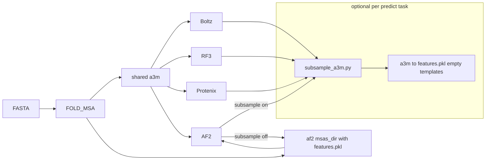

# MSA subsample in fold.nf + EnGens HDBSCAN

## Findings (context)

**CF-random git pull:** no material change to MSA method. Depths remain `max_seq:max_extra_seq` = 1:2, 2:4, 4:8, 8:16, 16:32, 32:64, 64:128. Recent commits mostly move shell `colabfold_batch` to the ColabFold Python API (`prediction_all_var.py`) and residue-range helpers — same algorithm.

**ColabFold monomer sampling to replicate** (from AlphaFold `sample_msa` + `crop_extra_msa`):
1. Always keep query (row 0).
2. Shuffle remaining rows without replacement; take first `max_seq` as selected.
3. Leftovers: second independent shuffle, crop to `max_extra_seq`.
4. Uniform over MSA rows (not HHBlits clusters). On-disk a3m is one fixed draw per task; AF2 would additionally re-draw internally if using `--max-seq` at model time — our file subsample approximates that across batches/seeds.

## AF2 templates vs subsample (design decision)

Fully unifying AF2 on a3m→`features.pkl` would drop jackhmmer template hits. That is wrong for the default (no-subsample) path.

**Hybrid (chosen):**

| Mode | AF2 input used | Templates |
|------|----------------|-----------|
| `--msa_subsample` off (default) | Existing precomputed `features.pkl` from jackhmmer MSA stage (or ColabFold→AF2 bridge) | Kept (jackhmmer); empty for ColabFold bridge as today |
| `--msa_subsample` on | Subsample shared a3m in-task → rebuild `features.pkl` via [bin/colabfold_a3m_to_af2_msas.py](bin/colabfold_a3m_to_af2_msas.py) | Empty (CF-random-style; a3m cannot carry `.hhr` templates) |
| `--msa_subsample_include_full` full-depth jobs under subsample mode | Prefer original `features.pkl` (templates) for that full job; shallow jobs use a3m→pkl | Full = templates; shallow = none |

Boltz / RF3 / Protenix always take a3m; subsample only rewrites the staged a3m (no template concept there).

## 1. `bin/subsample_a3m.py`

New CLI script (PEP 722 header, argparse, logging to stderr):

- Inputs: `--a3m`, `--max-seq`, `--max-extra-seq`, `--seed`, `-o/--output` (`-` = stdout).
- Algorithm: monomer ColabFold/AF2 logic above (query kept; two-stage shuffle).
- If input has fewer than `max_seq + max_extra_seq` sequences, clamp like ColabFold (`max_seq = min(N, max_seq)`, `max_extra_seq = max(min(N-max_seq, max_extra_seq), 1)` when possible).
- Emit subsampled a3m; exit non-zero on empty/malformed input.

Defaults for CF-random-like sweeps live in fold.nf params, not hardcoded in the script.

## 2. FOLD_MSA + AF2 hybrid path

### FOLD_MSA ([subworkflows/local/fold_msa.nf](subworkflows/local/fold_msa.nf))

Keep today’s dual emit:

- `af2_msas` = `(meta, fasta, msas_dir)` with `features.pkl` (jackhmmer or `COLABFOLD_A3M_TO_AF2_MSAS`) — **unchanged default predict path**.
- `for_boltz` / `for_rf3` / `for_protenix` = `(meta, fasta, a3m)`.

When AF2 is requested **and** `--msa_subsample` is set, also ensure an a3m is available for AF2 (already true when other methods need a3m; if AF2-only + subsample, still run `AF2_MSAS_TO_A3M` / keep ColabFold a3m). Do **not** remove `COLABFOLD_A3M_TO_AF2_MSAS` — still needed for the non-subsample AF2 path under `--msa_method mmseqs2_colabfold`.

### AF2 predict ([modules/fold/af2/alphafold2.nf](modules/fold/af2/alphafold2.nf) + [subworkflows/local/alphafold2.nf](subworkflows/local/alphafold2.nf))

- Input becomes `tuple val(meta), path(fasta), path(msa_dir), path(a3m)` (a3m may be a dummy/empty asset when subsample is off, mirroring other optional-path patterns in the repo — or only join a3m onto the channel when subsample is on so the process signature stays stable via a stub file).
- Script branch:
  - **No subsample / full-depth include job:** `cp -rL` `msa_dir` and run with existing `features.pkl` (templates preserved for jackhmmer).
  - **Shallow subsample job:** run `subsample_a3m.py` on a3m → `colabfold_a3m_to_af2_msas.py` → write `${meta.id}/features.pkl` (empty templates) → predict.
- Fan-out for `--n_predictions` / `--af2_keep_models` unchanged; each shallow run gets its own draw (seed from `meta.af2_run` / `meta.af2_seed`).

This preserves default AF2 quality while enabling CF-random-style shallow sampling without pretending a3m can carry templates.

## 3. Optional per-task MSA subsample (all four methods)

### Params (fold.nf)

- `--msa_subsample` (default `false`):
  - `false` / unset — no subsampling (current behaviour).
  - `true` — enable with the CF-random default depth set: `1:2,2:4,4:8,8:16,16:32,32:64,64:128`.
  - string — custom comma-separated `max_seq:max_extra_seq` list, e.g. `4:8,16:32` or a single depth `8:16`.
- Parse/validate in fold.nf: reject malformed pairs; treat Groovy/Nextflow boolean `true` and string `"true"` the same; expand `true` to the default list before fan-out.
- `--msa_subsample_include_full` = `true` (default): also keep one unsubsampled full-MSA job (CF-random dominant conformation). For AF2 that full job uses original `features.pkl` (templates).
- Seed: derive from existing batch/run seed when pinned (`meta.fold_batch`, `meta.af2_seed`, etc.); if unset, use a stable hash of `(meta.id, batch/run index, depth)` so `-resume` is stable without forcing CLI seeds.

### Wiring

**Do not** subsample in `FOLD_MSA` (would share one draw across all batches/methods).

At the **start of each predict process script**:

| Process | File | Notes |
|---------|------|--------|
| BOLTZ | [modules/local/common/boltz.nf](modules/local/common/boltz.nf) | Overwrite/replace staged a3m |
| RF3_FOLD | [modules/fold/rf3/rf3_fold.nf](modules/fold/rf3/rf3_fold.nf) | Spec currently bakes absolute `msa_path` — switch [bin/make_rf3_fold_spec.py](bin/make_rf3_fold_spec.py) to **basename** so in-place a3m replace works |
| PROTENIX_FOLD | [modules/fold/protenix/protenix_fold.nf](modules/fold/protenix/protenix_fold.nf) | Same basename fix in [bin/make_protenix_input.py](bin/make_protenix_input.py) |
| ALPHAFOLD2 | [modules/fold/af2/alphafold2.nf](modules/fold/af2/alphafold2.nf) | Hybrid branch above |

**Fan-out for depth × batch:** when `--msa_subsample` lists multiple depths, flatMap in each fold subworkflow so each `(batch, depth)` is a separate task (extreme: `--*_batch_size 1` ⇒ different random MSA per sample). Include full-depth job when `--msa_subsample_include_full`.

Tag / unique names: extend existing `boltz_batchN_` / `rf3_batchN_` / `af2_runN_` basenames with `_msa${max}_${extra}` so flat `fold/predictions/` and EnGens unique names stay collision-free. EnGens still groups by `meta.id` (FASTA stem).

## 4. EnGens: optional HDBSCAN

CF-random blind mode: Foldseek bitscore → PCA → HDBSCAN → K-medoids. We already have UMAP + GMM/KMeans; add HDBSCAN as a clustering option (not a full Foldseek reimplementation).

- Params: allow `--engens_clustering hdbscan` (and combinations like `gmm,hdbscan` if cheap).
- Validation in [fold.nf](fold.nf) / [engens.nf](engens.nf).
- [assets/engens/engens-analysis.qmd](assets/engens/engens-analysis.qmd): branch when method is HDBSCAN — call `sklearn.cluster.HDBSCAN` (or `hdbscan` if already in the engens container); skip fixed-`n` AIC/elbow; treat noise label `-1` explicitly; pick representatives as medoids (nearest to cluster centroid in embedding space).
- Confirm HDBSCAN availability in the engens Apptainer image; bump image only if missing.
- Prefer calling sklearn from the qmd rather than forking EnGens’ `ClustEn.py` registry unless the container already exposes a clean extension point.

## 5. Docs / config / changelog

- Update [examples/fold/README.md](examples/fold/README.md) and fold.nf help: `--msa_subsample` (`true` = CF-random depths; or custom `max:extra,...`), include-full, AF2 hybrid (templates kept when not subsampling; dropped on shallow subsample), EnGens `hdbscan`.
- Prefer in-task helper (no new process / `withName` unless needed).
- [CHANGELOG.md](CHANGELOG.md): Added optional MSA subsample; AF2 uses a3m→pkl only when subsampling; Added EnGens HDBSCAN option.

## Out of scope

- Replicating CF-random Foldseek all-vs-all bitscore matrix (EnGens UMAP+HDBSCAN is the analog).
- SPEACH-AF / AFSample2 column masking.
- Multimer MSA pairing / Phase 2 multimers.
- Bit-exact TF `random_shuffle` parity (algorithmic match is enough).
- Always-on a3m-only AF2 API (rejected — loses templates on the default path).
