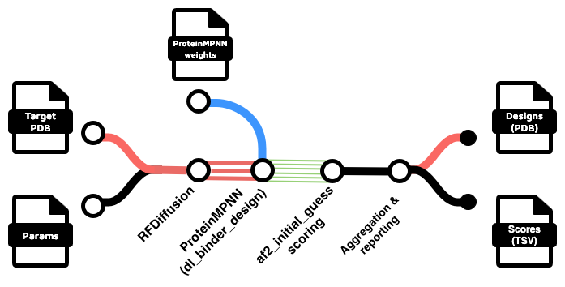

# nf-binder-design

[](https://doi.org/10.5281/zenodo.16809704) | [](https://australian-protein-design-initiative.github.io/nf-binder-design/)

Nextflow pipelines for _de novo_ protein binder design.



- RFdiffusion → ProteinMPNN → AlphaFold2 initial guess → Boltz-2 refolding
- RFdiffusion3 → MPNN → RosettaFold3 → Boltz-2 refolding
- RFdiffusion Partial Diffusion → Boltz-2 refolding
- BindCraft (in parallel across multiple GPUs)
- Germinal (antibody/nanobody design in parallel across multiple GPUs)
- BoltzGen (design proteins and peptides binders, in parallel across multiple GPUs)
- "Boltz Pulldown" (an AlphaPulldown-like protocol using Boltz-2)

----

> ⚠️ Note: Components of these workflows use RFdiffusion and BindCraft, which depend on PyRosetta/Rosetta, which is free for non-commercial use. Commercial use requires a paid license agreement with University of Washington: https://github.com/RosettaCommons/rosetta/blob/main/LICENSE.md and https://rosettacommons.org/software/licensing-faq/

----

> ⚠️ NOTE: Major change in `v0.2.0` - individual workflows have been shifted into `workflows/`, all launched via a single `main.nf` entry point with the `--method` flag. 
>          To modify any existing wrapper scripts, you should be able to simply use `nextflow run Australian-Protein-Design-Initiative/nf-binder-design --method <method>`.
>          and keep other arguments the same. ⚠️

----

## Documentation

----

**Full documentation at:** https://australian-protein-design-initiative.github.io/nf-binder-design/

An [agent skill](.agents/skills/nf-binder-design/SKILL.md) is included for AI-assisted setup, configuration, and execution of the pipeline workflows.

----

## Quickstart

### Setup

Install [Nextflow](https://www.nextflow.io/docs/latest/install.html).

Pull the workflow:

```bash
nextflow pull Australian-Protein-Design-Initiative/nf-binder-design
```

### AI Agent Skill

An agent skill is included at [`.agents/skills/nf-binder-design/`](.agents/skills/nf-binder-design/SKILL.md) to help AI coding agents set up, configure, and run the pipeline. Install it into your project with [skills](https://github.com/vercel-labs/skills):

```bash
npx skills add Australian-Protein-Design-Initiative/nf-binder-design --skill nf-binder-design
```

### Running on a local GPU workstation

A minimal RFdiffusion binder design run against the PD-L1 example target (requires a local GPU and [Apptainer](https://apptainer.org/)):

```bash
# Make a working directory and download a target PDB
mkdir -p pdl1-rfd/input
cd pdl1-rfd
wget -O input/PDL1.pdb https://raw.githubusercontent.com/Australian-Protein-Design-Initiative/nf-binder-design/refs/heads/main/examples/pdl1-rfd/input/PDL1.pdb

# Run the workflow
nextflow run Australian-Protein-Design-Initiative/nf-binder-design \
  --method rfd \
  --input_pdb 'input/*.pdb' \
  --contigs "[A18-132/0 65-120]" \
  --hotspot_res "A56" \
  --rfd_n_designs=4 \
  -profile local \
  -resume
```

### Running on an HPC cluster

```bash
mkdir -p pdl1-rfd/input
cd pdl1-rfd
wget -O input/PDL1.pdb https://raw.githubusercontent.com/Australian-Protein-Design-Initiative/nf-binder-design/refs/heads/main/examples/pdl1-rfd/input/PDL1.pdb

nextflow run Australian-Protein-Design-Initiative/nf-binder-design \
  --method rfd \
  --input_pdb 'input/*.pdb' \
  --contigs "[A18-132/0 65-120]" \
  --hotspot_res "A56" \
  --rfd_n_designs=4 \
  -profile slurm \
  -resume
```

> You'll almost certainly need to create a custom configuration file for your HPC cluster. See `conf/platforms/` for specific HPC platform configuration examples, eg `-profile slurm,m3`.

### Commandline options

For any workflow, list available options with `--help`:

```bash
nextflow run Australian-Protein-Design-Initiative/nf-binder-design \
  --method rfd --help
```

Available methods: `rfd`, `rfd3`, `rfd_partial`, `bindcraft`, `germinal`, `boltzgen`, `boltz_pulldown`, `foldseek`

Any `--params` option can alternatively be defined in a `params.json` file and passed with `-params-file params.json`.

For running tests and other contributor notes, see [Development](https://australian-protein-design-initiative.github.io/nf-binder-design/extra/development/).

## More examples

See the [examples](examples/) directory and [workflow documentation](https://australian-protein-design-initiative.github.io/nf-binder-design/) for other methods (including Germinal), HPC configs, and production-scale runs.

## License

MIT

> Note that some software dependencies of the pipeline are under less permissive licenses - in particular, RFdiffusion and BindCraft use [Rosetta/PyRosetta](https://github.com/RosettaCommons/rosetta/blob/main/LICENSE.md) which is **only free for Non-Commercial use**.
