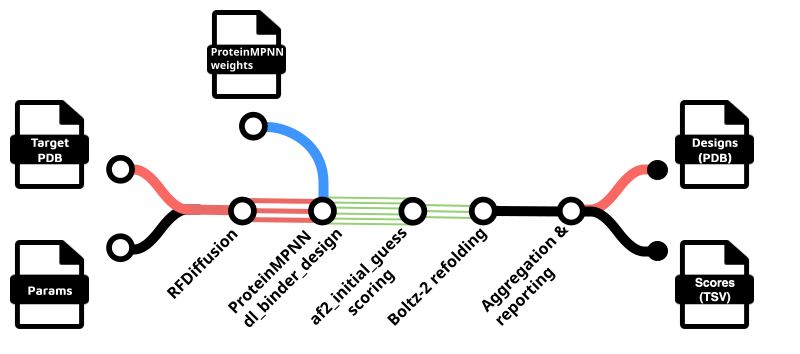

# nf-binder-design

[](https://doi.org/10.5281/zenodo.16809704) | [](https://australian-protein-design-initiative.github.io/nf-binder-design/)

Nextflow pipelines for de novo protein binder design.

> ⚠️ NOTE: Major change in `v0.2.0` - individual workflows have been shifted into `workflows/`, all launched via a single `main.nf` entry point with the `--method` flag. 
>          To modify any existing wrapper scripts, you should be able to simply use `nextflow run Australian-Protein-Design-Initiative/nf-binder-design --method <method>`.
>          and keep other arguments the same. ⚠️



- RFdiffusion → ProteinMPNN → AlphaFold2 initial guess → Boltz-2 refolding
- RFdiffusion Partial Diffusion → Boltz-2 refolding
- BindCraft (in parallel across multiple GPUs)
- BoltzGen (design proteins and peptides binders using BoltzGen)
- "Boltz Pulldown" (an AlphaPulldown-like protocol using Boltz-2)

----

> ⚠️ Note: Components of these workflows use RFdiffusion and BindCraft, which depend on PyRosetta/Rosetta, which is free for non-commercial use. Commercial use requires a paid license agreement with University of Washington: https://github.com/RosettaCommons/rosetta/blob/main/LICENSE.md and https://rosettacommons.org/software/licensing-faq/

----

Full documentation: https://australian-protein-design-initiative.github.io/nf-binder-design/

- [nf-binder-design](#nf-binder-design)
  - [Setup](#setup)
  - [Examples](#examples)
    - [Commandline options](#commandline-options)
  - [Binder design with RFdiffusion](#binder-design-with-rfdiffusion)
    - [Single node or local workstation](#single-node-or-local-workstation)
    - [Parallel on an HPC cluster](#parallel-on-an-hpc-cluster)
  - [Partial diffusion on binder designs](#partial-diffusion-on-binder-designs)
  - [Binder design with BindCraft](#binder-design-with-bindcraft)
  - [Binder design with BoltzGen](#binder-design-with-boltzgen)
  - [License](#license)


## Setup

Install [Nextflow](https://www.nextflow.io/docs/latest/install.html).

Clone the git repository:

```bash
git clone https://github.com/Australian-Protein-Design-Initiative/nf-binder-design
```

## Examples

See the [examples](examples/) directory for examples.

### Commandline options

For any of the workflows, you can see the commandline options with `--help`, eg:

```bash
nextflow run Australian-Protein-Design-Initiative/nf-binder-design \
  --method rfd --help
nextflow run Australian-Protein-Design-Initiative/nf-binder-design \
  --method bindcraft --help
nextflow run Australian-Protein-Design-Initiative/nf-binder-design \
  --method boltzgen --help
```

Available methods: `rfd`, `rfd_partial`, `bindcraft`, `boltzgen`, `boltz_pulldown`

Any of the `--params` commandline options can alternatively be defined in a `params.json` file and passed to the workflow with `-params-file params.json`.

## Binder design with RFdiffusion

### Single node or local workstation

Simple example (single 'local' compute node):

```bash
OUTDIR=results
mkdir -p $OUTDIR/logs

nextflow run Australian-Protein-Design-Initiative/nf-binder-design \
    --method rfd \
    --input_pdb target.pdb \
    --outdir $OUTDIR \
    --contigs "[A371-508/A753-883/A946-1118/A1135-1153/0 70-100]" \
    --hotspot_res "A473,A995,A411,A421" \
    --rfd_n_designs=10 \
    --rfdiffusion_batch_size 1 \
    -with-report $OUTDIR/logs/report_$(date +%Y%m%d_%H%M%S).html \
    -with-trace $OUTDIR/logs/trace_$(date +%Y%m%d_%H%M%S).txt \
    -resume \
    -profile local
```

> If you are working on a specific HPC cluster like M3 or MLeRP, you should omit `-profile local` and add the `-c` flag pointing to the specific platform config, eg `-c conf/platforms/m3.config` for M3.

See the [rfd workflow documentation](https://australian-protein-design-initiative.github.io/nf-binder-design/workflows/rfdiffusion/) for more details on options available.

### Parallel on an HPC cluster

A more complex example, as a wrapper script for the M3 HPC cluster, using a the site-specific config (`-c`), a specific RFdiffusion model (`--rfd_model_path`), a radius of gyration filter on the generated RFdiffusion backbones (`--rfd_filters`), custom ProteinMPNN weights (`--pmpnn_weigths`) and radius of gyration potentials (`--rfd_extra_args`):

```bash
#!/bin/bash
# CHANGE THIS - this is the path where your git clone of this repo is
WF_PATH="/some/path/to/nf-binder-design"

mkdir -p results/logs
DATESTAMP=$(date +%Y%m%d_%H%M%S)

# Ensure our tmp directory is in a location with enough space
export TMPDIR=$(realpath ./tmp)
export NXF_TEMP=$TMPDIR
mkdir -p $TMPDIR

# CHANGE THIS to a path in scratch or scratch2 to act as the cache directory for apptainer
# Containers will be automatically downloaded to this path.
# You can add it to ~/.bashrc if you prefer
export NXF_APPTAINER_CACHEDIR=/some/path/to/scratch2/apptainer_cache
export NXF_APPTAINER_TMPDIR=$TMPDIR

# There's a module for Nextflow on M3
module load nextflow/24.04.3 || true

# CHANGE the --slurm_account to match the project ID you wish to run SLURM jobs under
nextflow \
-c ${WF_PATH}/conf/platforms/m3.config run \
${WF_PATH}/main.nf \
--method rfd \
--slurm_account=ab12 \
--input_pdb 'input/target_cropped.pdb' \
--design_name my-binder \
--outdir results \
--contigs "[B346-521/B601-696/B786-856/0 70-130]" \
--hotspot_res "B472,B476,B484,B488" \
--rfd_n_designs=1000 \
--rfd_batch_size=5 \
--rfd_filters="rg<20" \
--pmpnn_seqs_per_struct=2 \
--pmpnn_relax_cycles=1 \
--pmpnn_weigths="/models/HyperMPNN/retrained_models/v48_020_epoch300_hyper.pt" \
--rfd_model_path="/models/rfdiffusion/Complex_beta_ckpt.pt" \
--rfd_extra_args='potentials.guiding_potentials=[\"type:binder_ROG,weight:7,min_dist:10\"] potentials.guide_decay="quadratic"' \
-resume \
-with-report results/logs/report_${DATESTAMP}.html \
-with-trace results/logs/trace_${DATESTAMP}.txt
```

See the [M3 HPC cluster examples](https://australian-protein-design-initiative.github.io/nf-binder-design/extra/m3-hpc-examples/) for more examples specific to running on SLURM.

## Partial diffusion on binder designs

> NOTE: It seems with output from previous designs that the binder is always named chain A, and your other chains are named B, C, etc - irrespective of the chain ID in the original target PDB file. Residue numbering is 1 to N, sequential irrespective of gaps in the chain, rather than original target chain numbering.

```bash
OUTDIR=results
mkdir -p $OUTDIR/logs

# Generate 10 partial designs for each binder, in batches of 5
# Note the 'single quotes' around the '*.pdb' glob pattern !
nextflow run Australian-Protein-Design-Initiative/nf-binder-design \
    --method rfd_partial \
    --input_pdb 'my_designs/*.pdb' \
    --rfd_n_partial_per_binder=10 \
    --rfd_batch_size=5 \
    --hotspot_res "A473,A995,A411,A421" \
    --rfd_partial_T=2,5,10,20 \
    -with-report $OUTDIR/logs/report_$(date +%Y%m%d_%H%M%S).html \
    -with-trace $OUTDIR/logs/trace_$(date +%Y%m%d_%H%M%S).txt \
    -profile local
```

See the [rfd_partial workflow documentation](https://australian-protein-design-initiative.github.io/nf-binder-design/workflows/rfdiffusion/rfdiffusion/#partial-diffusion-on-binder-designs-method-rfd_partial) for more details on options available.

## Binder design with BindCraft


The `--method bindcraft` workflow helps run [BindCraft](https://github.com/martinpacesa/BindCraft) trajectories in parallel across multiple GPUs.
This is particularly well suited for running BindCraft on an HPC cluster, or a workstation with multiple GPUs.

Unlike the default BindCraft configuration which runs for an indeterminate amount of time until a number of accepted designs are found,
this pipeline will run a fixed number of trajectories `--bindcraft_n_traj` and stop.

Example:

```bash
DATESTAMP=$(date +%Y%m%d_%H%M%S)

nextflow run Australian-Protein-Design-Initiative/nf-binder-design \
  --method bindcraft \
  --input_pdb 'input/PDL1.pdb' \
  --outdir results \
  --target_chains "A" \
  --hotspot_res "A56,A125" \
  --hotspot_subsample 0.5 \
  --binder_length_range "55-120" \
  --bindcraft_n_traj 2 \
  --bindcraft_batch_size 1 \
  --bindcraft_advanced_settings_preset "default_4stage_multimer" \
  --bindcraft_filters_preset "default_filters" \
  -profile local \
  -resume \
  -with-report results/logs/report_${DATESTAMP}.html \
  -with-trace results/logs/trace_${DATESTAMP}.txt
```

`--bindcraft_advanced_settings_preset` and `--bindcraft_filters_preset` are are those available in the BindCraft [settings_advanced](https://github.com/martinpacesa/BindCraft/tree/main/settings_advanced) and [settings_filters](https://github.com/martinpacesa/BindCraft/tree/main/settings_filters) directories (without the .json extension).

`--hotspot_subsample` randomly takes this random proportion of the hotspot residues for each design, allowing the impact of hotspot selection to be explored in a single run.

If you have multiple GPUs per compute node, you can specify them with the `--gpu_devices` flag, eg `--gpu_devices=0,1`.

Results are saved to the `--outdir` directory, in the `bindcraft` subdirectory, with CSV outputs from each batch combined into single tables, eg `bindcraft/final_design_stats.csv`.

A report summarizing the results is generated in `bindcraft_report.html`.

See the [bindcraft workflow documentation](https://australian-protein-design-initiative.github.io/nf-binder-design/workflows/bindcraft/) for more details on options and output.

## Binder design with BoltzGen


The `--method boltzgen` workflow automates the design of binders using the [BoltzGen](https://github.com/HannesStark/boltzgen) generative model.
It supports `protein-anything`, `peptide-anything`, `protein_small-molecule` and `nanobody-anything` protocols.

Example:

```bash
nextflow run Australian-Protein-Design-Initiative/nf-binder-design \
    --method boltzgen \
    --config_yaml config/my_design.yaml \
    --outdir results \
    --num_designs 100 \
    --batch_size 10 \
    --devices 1
```

See the [boltzgen workflow documentation](https://australian-protein-design-initiative.github.io/nf-binder-design/workflows/boltzgen/) for more details on configuration files and options.

## License

MIT

> Note that some software dependencies of the pipeline are under less permissive licenses - in particular, RFdiffusion and BindCraft use [Rosetta/PyRosetta](https://github.com/RosettaCommons/rosetta/blob/main/LICENSE.md) which is **only free for Non-Commercial use**.
