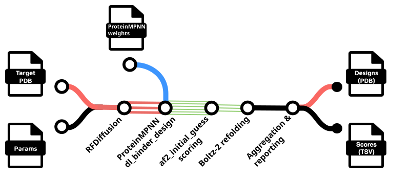

# nf-binder-design

Nextflow pipelines for de novo protein binder design.

## Overview

This project provides Nextflow workflows for _de novo_ design of protein binders:

- **RFdiffusion → ProteinMPNN → AlphaFold2(initial guess)** pipeline
- **RFdiffusion Partial Diffusion** for diversification and optimization
- **BindCraft** - parallel execution across multiple GPUs
- **Boltz Pulldown** - an AlphaPulldown-like protocol using Boltz-2

## Features

- **Flexible workflow options** for different binder design strategies
- **HPC-ready** with support for SLURM and other job schedulers
- **Multi-GPU parallelization** for BindCraft trajectories
- **Plugin system** for custom design filters
- **Comprehensive reporting** with HTML outputs and summary statistics

## Quick Links

- [Setup Instructions](setup.md)
- [RFdiffusion Workflows](rfdiffusion.md)
- [BindCraft Workflow](bindcraft.md)
- [Boltz Pulldown](boltz-pulldown.md)
- [Utility Scripts](utility-scripts.md)
- [GitHub Repository](https://github.com/Australian-Protein-Design-Initiative/nf-binder-design)
- [Examples Directory](https://github.com/Australian-Protein-Design-Initiative/nf-binder-design/tree/main/examples)

## License

The pipeline code the comprises `nf-binder-design` is licensed under the MIT License.

**Note** that some dependencies, packaged externally as containers, are under less permissive licenses:

> ⚠️ "Commercial Use Restrictions"
> >
> Components of these workflows use RFdiffusion and BindCraft, which depend on PyRosetta/Rosetta. These are  **free for non-commercial use only**. Commercial use requires a paid license agreement with University of Washington. See:
>
> - [Rosetta License](https://github.com/RosettaCommons/rosetta/blob/main/LICENSE.md)
> - [Rosetta Licensing FAQ](https://rosettacommons.org/software/licensing-faq/)

## Citing

If you use `nf-binder-design` in your research, please cite:

- Perry, A., Taveneau, C., & Knott, G. J. (2025). nf-binder-design: a Nextflow pipeline for protein binder design (0.1.4). Zenodo. [https://doi.org/10.5281/zenodo.16809705](https://doi.org/10.5281/zenodo.16809705)

and include citations for the underlying tools used in the workflow as appropriate:
  
  - RFdiffusion
    - Watson, J.L., Juergens, D., Bennett, N.R. et al. "De novo design of protein structure and function with RFdiffusion.", _Nature_, **620**, 1089–1100 (2023). [https://doi.org/10.1038/s41586-023-06415-8](https://doi.org/10.1038/s41586-023-06415-8)
  
    - Bennett, N.R., Coventry, B., Goreshnik, I. et al. Improving de novo protein binder design with deep learning. _Nat Commun_, **14**, 2625 (2023). [https://doi.org/10.1038/s41467-023-38328-5](https://doi.org/10.1038/s41467-023-38328-5)
  
  - ProteinMPNN
  
    - Dauparas, J. et al. Robust deep learning–based protein sequence design using ProteinMPNN. _Science_, **378**,49-56(2022). [https://doi.org/10.1126/science.add2187](https://doi.org/10.1126/science.add2187)
  
  - Alphafold2
     - Jumper, J. et al. Highly accurate protein structure prediction with AlphaFold. Nature 596, 583–589 (2021). [https://doi.org/10.1038/s41586-021-03819-2](https://doi.org/10.1038/s41586-021-03819-2)
   
   - BindCraft
     - Pacesa, M., Nickel, L., Schellhaas, C. et al. One-shot design of functional protein binders with BindCraft. _Nature_, **645**, 1005-1010 (2025). [https://doi.org/10.1038/s41586-025-09429-6](https://doi.org/10.1038/s41586-025-09429-6)

  - Boltz
    - Passaro, S., Corso, G., Wohlwend, J. et al. Boltz-2: Towards Accurate and Efficient Binding Affinity Prediction. _bioRxiv_ (2025). [https://doi.org/10.1101/2025.06.14.659707](https://doi.org/10.1101/2025.06.14.659707)
    - Wohlwend, J., Corso, G., Passaro, S. et al. Boltz-1: Democratizing Biomolecular Interaction Modeling. _bioRxiv_ (2024). [https://doi.org/10.1101/2024.11.19.624167](https://doi.org/10.1101/2024.11.19.624167)
  
  - ColabFold
    - Mirdita, M., Schütze, K., Moriwaki, Y. et al. ColabFold: making protein folding accessible to all. _Nature Methods_, **19**, 679-682 (2022). [https://doi.org/10.1038/s41592-022-01488-1](https://doi.org/10.1038/s41592-022-01488-1)
