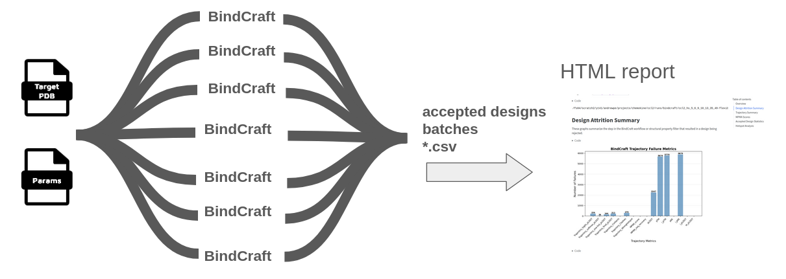

# BindCraft Workflow



Parallel [BindCraft](https://github.com/martinpacesa/BindCraft) execution for protein binder design across multiple GPUs.

## Overview

The `--method bindcraft` workflow runs [BindCraft](https://github.com/martinpacesa/BindCraft) trajectories in parallel across multiple GPUs - ideal for HPC clusters or multi-GPU workstations.

## Key Differences

Unlike a 'vanilla' BindCraft run which runs on a single GPU indefinitely until finding `N` accepted designs, this pipeline:

- Runs a **fixed number of trajectories** (`--bindcraft_n_traj`)
- Stops when complete (predictable runtime)
- Parallelizes across available GPUs
- Outputs an HTML summary report

If you want to generate a specific number of accepted designs, we suggest running a small number of trajectories (`--bindcraft_n_traj 100` or `--bindcraft_n_traj 300`) to assess the acceptance rate, then knowing the ratio of accepted designs to total trajectories, do a larger run to generate (approximately) the desired number of accepted designs.

## Command-line Options

See available options with `--help`:

```bash
nextflow run Australian-Protein-Design-Initiative/nf-binder-design \
  --method bindcraft --help
```

## Example Usage

```bash
DATESTAMP=$(date +%Y%m%d_%H%M%S)

nextflow run Australian-Protein-Design-Initiative/nf-binder-design \
  --method bindcraft \
  --input_pdb 'input/PDL1.pdb' \
  --outdir results \
  --target_chains "A" \
  --hotspot_res "A56,A125" \
  --hotspot_subsample 0.5 \
  --binder_length_range "55-120" \
  --bindcraft_n_traj 2 \
  --bindcraft_batch_size 1 \
  --bindcraft_advanced_settings_preset "default_4stage_multimer" \
  --bindcraft_filters_preset "default_filters" \
  -profile local \
  -resume \
  -with-report results/logs/report_${DATESTAMP}.html \
  -with-trace results/logs/trace_${DATESTAMP}.txt
```

For running on SLURM, you can use the `-profile slurm` flag instead of `-profile local`, with `--slurm_account=xxYY` and the appropriate `-c` site-specific configuration file (refer to and adapt from the [rfdiffusion example](rfdiffusion.md#parallel-tasks-on-an-hpc-cluster)).

## Key Parameters

- `--input_pdb`: Target protein structure
- `--target_chains`: Target chain IDs (comma-separated)
- `--hotspot_res`: Hotspot residues (comma-separated)
- `--hotspot_subsample`: Random proportion of hotspot residues per design (explores hotspot selection)
- `--binder_length_range`: Range of binder lengths to design
- `--bindcraft_n_traj`: Number of trajectories to run
- `--bindcraft_batch_size`: Number of trajectories per batch
- `--gpu_devices`: Specify multiple GPUs, e.g., `--gpu_devices=0,1` - use only for `-profile local`

## BindCraft Presets

### Advanced Settings Presets

- `--bindcraft_advanced_settings_preset`: Use a preset from [settings_advanced](https://github.com/martinpacesa/BindCraft/tree/main/settings_advanced) (without .json extension)

> Keep in mind, the experimental success rate of the advanced presets may not have been as rigorously validated as the `default4stage_multimer` preset. _Caveat emptor._

### Filter Presets

- `--bindcraft_filters_preset`: Use filter settings presets from [settings_filters](https://github.com/martinpacesa/BindCraft/tree/main/settings_filters) (without .json extension). In most cases, it's probably best to stick with the default.

## Output Structure

Results are saved to `--outdir` in the `bindcraft/` subdirectory:

```
── bindcraft
│   ├── accepted
│   │   └── results
│   │       └── Accepted
│   │           ├── bindcraft_design_1_l57_s942028_mpnn6_model1.pdb
│   │           └── bindcraft_design_1_l57_s942028_mpnn8_model2.pdb
│   ├── batches
│   │   ├── 0
│   │   │   └── results
│   │   │       ├── failure_csv.csv
│   │   │       ├── final_design_stats.csv
│   │   │       ├── mpnn_design_stats.csv
│   │   │       ├── Trajectory
│   │   │       └── trajectory_stats.csv
│   │   └── 1
│   │       └── results
│   │           ├── Accepted
│   │           ├── failure_csv.csv
│   │           ├── final_design_stats.csv
│   │           ├── MPNN
│   │           ├── mpnn_design_stats.csv
│   │           ├── Rejected
│   │           ├── Trajectory
│   │           └── trajectory_stats.csv
│   ├── bindcraft_report.html
│   ├── failure_csv.csv
│   ├── final_design_stats.csv
│   ├── mpnn_design_stats.csv
│   └── trajectory_stats.csv
└── logs
    ├── report_20250725_084959.html
    ├── trace_20250725_084959.txt
```

A summary report is generated as `bindcraft_report.html`.

## Examples

The [examples/](https://github.com/Australian-Protein-Design-Initiative/nf-binder-design/tree/main/examples) directory contains complete working examples for BindCraft workflows:

- `examples/pdl1-bindcraft`: PDL1 binder example from the BindCraft repository
- `examples/egfr-bindcraft`: an EGFR binder design example
- `examples/mdm2-bindcraft-peptide` - peptide binder design for MDM2, based on [Filus et al, 2025](https://doi.org/10.1101/2025.07.23.666285)

See the [examples/README.md](https://github.com/Australian-Protein-Design-Initiative/nf-binder-design/blob/main/examples/README.md) for details.
