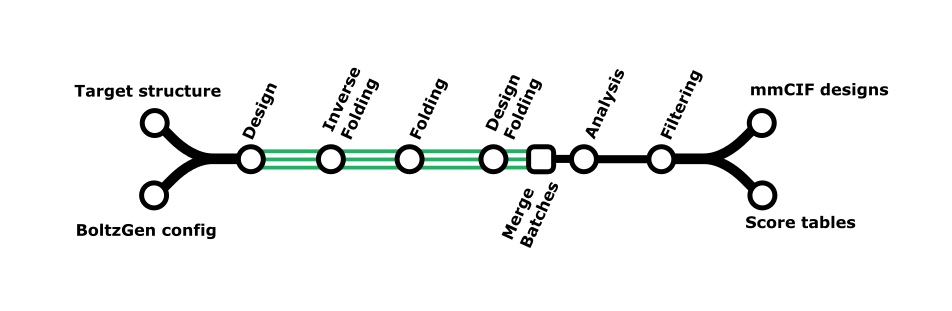

# BoltzGen Workflow



The `--method boltzgen` workflow automates the design of binders using the [BoltzGen](https://github.com/HannesStark/boltzgen) generative model.
The key advantage of this workflow is improved parallelization across multiple GPUs and better resource allocation on HPC clusters.

It supports the `protein-anything`, `peptide-anything`, `protein_small-molecule` and `nanobody-anything` protocols.

## Overview

The BoltzGen workflow performs the following steps, as per `boltzgen run`:

-  **Design**: Generates binder backbone structures based on a YAML configuration.
-  **Inverse Folding**: Generates sequences for the designed backbones.
-  **Folding**: Re-folds the designed binder in complex with the target.
-  **Design Folding**: Re-folds the designed binder alone.
-  **Affinity**: (Optional -  `protein_small-molecule` protocol only) Calculates affinity scores for protein-small molecule complexes.
- (**Merge batches**: nf-binder-design `--method boltzgen` merges independently generated batches of designs, ready for analysis and filtering)
-  **Analysis & Filtering**: Aggregates scores and filters designs based on user-defined criteria.

## General Information

### Command-line Options

You can see available options with `--help`:

```bash
nextflow run Australian-Protein-Design-Initiative/nf-binder-design \
  --method boltzgen --help
```

### YAML Configuration

The BoltzGen workflow is controlled by a YAML configuration file passed via `--config_yaml`. This file defines the input structure, constraints, and design objectives. Refer to the [BoltzGen documentation](https://github.com/HannesStark/boltzgen?tab=readme-ov-file#how-to-make-a-design-specification-yaml) on how to prepare your configuration file.

> **Note:** ⚠️ BoltzGen expects residues specified as indices starting at 1, irresepctive of the numbering in your PDB/mmCIF file. You may find it easier to use `bin/renumber_chains.py` to renumber your input PDB to be sequentially numbered starting at 1 to simplify choosing hotspot residues in ChimeraX/Pymol/Molstar etc.

## Usage

### Basic Execution

To run the workflow with a configuration file:

```bash
nextflow run Australian-Protein-Design-Initiative/nf-binder-design \
  --method boltzgen \
  --config_yaml config/my_design.yaml
```

### Key Parameters

- `--config_yaml`: **(Required)** Path to the BoltzGen YAML configuration file.
- `--outdir`: Output directory for results (default: `results`).
- `--design_name`: Name of the design, used for output file prefixes. Defaults to the basename of the config file.
- `--protocol`: Protocol type. Options:
    - `protein-anything` (default)
    - `peptide-anything`
    - `protein-small_molecule`
    - `nanobody-anything`
- `--num_designs`: Total number of designs to generate (default: 100).
- `--inverse_fold_num_sequences`: Number of sequences to generate per backbone during the inverse folding step (default: 1).
- `--batch_size`: Number of designs to process per batch (default: 10).
- `--budget`: Final number of designs to keep after diversity optimization and filtering (default: 10).
- `--devices`: Number of GPU devices to use (default: 1).
- `--num_workers`: Number of DataLoader workers.

#### Filtering Parameters

- `--alpha`: Trade-off for sequence diversity selection: 0.0=quality-only, 1.0=diversity-only.
- `--filter_biased`: Remove amino-acid composition outliers (default: true, use `--filter_biased false` to disable).
- `--metrics_override`: Per-metric inverse-importance weights for ranking. Format: `metric_name=weight` (e.g., `'plip_hbonds_refolded=4' 'delta_sasa_refolded=2'`).
- `--additional_filters`: Extra hard filters. Format: `feature>threshold` or `feature<threshold` (e.g., `'design_ALA>0.3' 'design_GLY<0.2'`).
- `--size_buckets`: Constraint for maximum designs in size ranges. Format: `min-max:count` (e.g., `'10-20:5' '20-30:10'`).
- `--refolding_rmsd_threshold`: Threshold used for RMSD-based filters (lower is better).

## Key Outputs

The `results` directory (or specified `--outdir`) will contain:

- `params.json`: A record of the parameters used for the run.
- `boltzgen/batches`: Each independent design batch, in folders for each step (`design`, `inverse_folding`, `folding`, `design_folding`)
- `bolzgen/merged`: All batches merged, after the 'analysis' step. 
- `boltzgen/filtered`: Final designs are in `filtered/final_ranked_designs` after the 'filtering' step.

`boltzgen/merged` should be equivalent to the output of a non-Nextflow execution of `boltzgen run` - see the [BoltzGen docs for details on the pipeline output](https://github.com/HannesStark/boltzgen?tab=readme-ov-file#pipeline-output).

## Re-running Filtering

Use `boltzgen_filter.nf` to re-run filtering on existing results with different parameters:

```bash
nextflow run boltzgen_filter.nf --run results/boltzgen/merged --budget 20 --alpha 0.05
```

The `--config_yaml` and `--protocol` are auto-detected from `params.json` if not specified. All filtering parameters from the main workflow are available.

Results are saved to `results/boltzgen/filtered/final_ranked_designs/`.

## Examples

The [examples/](https://github.com/Australian-Protein-Design-Initiative/nf-binder-design/tree/main/examples) directory contains complete working examples for BoltzGen workflows:

- `examples/boltzgen-protein`: Protein binder design (protocol `protein-anything`)
- `examples/boltzgen-cyclic-peptide`: Cyclic peptide binder design (protocol `peptide-anything`)
- `examples/boltzgen-small-molecule-binder`: Small molecule binder design (protocol `protein-small_molecule`)

See the [examples/README.md](https://github.com/Australian-Protein-Design-Initiative/nf-binder-design/blob/main/examples/README.md) for details.
