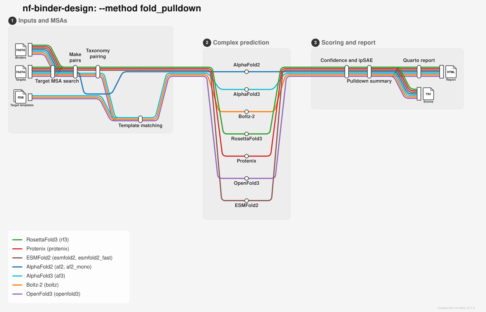

# Fold Pulldown



Multi-model target × binder pulldown, in the spirit of
[Boltz Pulldown](boltz-pulldown.md) but using the shared fold engines
(AlphaFold2, Boltz-2, RosettaFold3, Protenix, AlphaFold3, OpenFold3, ESMFold2, ESMFold2-Fast).

## Overview

For every target–binder pair the pipeline co-folds the complex with each
selected predictor (optionally with multiple seeds / samples per model), then
writes:

| File | Contents |
|------|----------|
| `fold_pulldown/fold_pulldown_scores.tsv` | One row per predicted structure (canonical fold scores + `target`, `binder`) |
| `fold_pulldown/fold_pulldown_summary.tsv` | One row per `(target, binder, tool)` with mean/median/max/sd for `iptm` and `ipsae`, per-target within-tool z-scores, cross-tool `consensus_z`, and the `z_basis` / `n_pool` / `z_pool_small` provenance of that z |
| `fold_pulldown/fold_pulldown_report.html` | Simple Quarto overview (boxplots, heatmaps, top hits, cross-tool Spearman) |

MSA cost is **O(N_targets + N_binders)**, not O(N × M): each sequence is searched
once. Binders are treated as having no useful homologs (query-only MSA unless
`--create_binder_msa` is set). There is **no cross-chain MSA pairing** — this is
intentional for designed binders.

FASTA header ids are used as per-chain filenames and are sanitised (non
`[a-zA-Z0-9_.-]` characters become `_`) before use. The pipeline fails fast,
listing the offending ids, on: duplicate ids within `--targets` or within
`--binders`; an id present in both `--targets` and `--binders`; ids that
collide only after sanitisation; and ids whose pair id
(`<target>_and_<binder>`) is ambiguous (an id containing the literal
`_and_`, e.g. target `a_and_b` + binder `c` colliding with target `a` +
binder `b_and_c`).

## Command-line options

```bash
nextflow run Australian-Protein-Design-Initiative/nf-binder-design \
  --method fold_pulldown --help
```

### Required

| Flag | Description |
|------|-------------|
| `--targets` | FASTA of target sequences |
| `--binders` | FASTA of binder sequences |

### Common options

| Flag | Default | Description |
|------|---------|-------------|
| `--methods` | `boltz` | Comma-separated: `af2`, `af2_mono`, `boltz`, `rf3`, `protenix`, `af3`, `openfold3`, `esmfold2`, `esmfold2_fast` (see [Choosing engines](fold.md#choosing-engines); ESMFold2 weights and caveats are covered in [ESMFold2](fold.md#esmfold2)) |
| `--af3_model_dir` | `models/alphafold3` | AlphaFold3 weights directory (`af3` only; see [AlphaFold3 weights](fold.md#alphafold3-weights)) |
| `--msa_method` | `jackhmmer_af2` | `jackhmmer_af2` or `mmseqs2_colabfold` |
| `--create_target_msa` | `false` | Build MSA for each target |
| `--create_binder_msa` | `false` | Build MSA for each binder (usually leave off for de novo binders). AF2/`af2_mono` always fold the binder chain query-only regardless of this flag (see `bin/fold/assemble_af2_multimer_msas.py`); if AF2/`af2_mono` are the only selected `--methods`, the pipeline warns and skips building the binder MSA entirely. |
| `--n_predictions` | unset | Samples per complex per method (engine defaults if unset) |
| `--skip_engens` | `true` | EnGens is off by default (would emit N × M reports) |
| `--consensus_metric` | `ipsae` | `ipsae` or `iptm`; which metric's per-tool z-scores are averaged into `consensus_z` |
| `--z_stat` | `max` | `max` or `mean`; the per-complex statistic over samples that gets standardised |
| `--z_scope` | `target` | `target` standardises within `(target, tool)`; `global` pools all targets into one distribution |
| `--min_pool` | `10` | Pools holding fewer complexes than this are flagged `z_pool_small` in the summary and warned about on stderr |

Every pair is a 2-chain complex, so `af2` and `af2_mono` under
`--msa_method jackhmmer_af2` both need a `uniprot/`-bearing `--af2_db_path`
(default `alphafold_20211129`; the [Fold](fold.md) workflow instead defaults to
`alphafold_20240229`, which is monomer-only). Target MSAs for AF2 are built once
(jackhmmer, or a ColabFold/mmseqs2 a3m converted into AF2's per-chain format)
and combined with the query-only binder chain into one AF2 multimer input per
pair.

Every method-specific flag documented under `--method fold --help` (`--af2_*`,
`--boltz_*`, `--rf3_*`, `--protenix_*`, `--af3_*`, `--openfold3_*`,
`--esmfold2_*`) applies here too — the same engines, run per target×binder pair instead of per input FASTA.
A couple worth knowing about: `--af2_keep_models` (`best` by default) controls
which of AF2's 5 models/run are kept, same as in `--method fold`.

### Templates

When a target's structure is known, pass it with `--templates` (a directory or
glob of `.pdb` / `.cif` files, e.g. the target PDBs themselves). Templates are
matched to target chains automatically by sequence; see
[Templates](fold.md#templates). In a pulldown:

- Only the **target** chain is templated by default. `--binder_templates true`
  also matches binder chains against the same files, e.g. when a complex
  structure includes a known binder.
- Boltz holds templated chains close to their template by default
  (`--boltz_template_force`, 1.0 Å), because the chain structures are known and
  the binding pose is what is being predicted. Pass `--boltz_template_force false`
  to let Boltz depart from them.
- Templates are used by `af3`, `boltz` and `openfold3`; other engines fold without them.

## Example

```bash
nextflow run Australian-Protein-Design-Initiative/nf-binder-design \
  --method fold_pulldown \
  --targets targets.fasta \
  --binders binders.fasta \
  --methods boltz,rf3,protenix \
  --create_target_msa true \
  --msa_method jackhmmer_af2 \
  --n_predictions 5 \
  --outdir results \
  -profile slurm,m3
```

## Output

Default layout under `--outdir` (`params.json` and `logs/` sit at the outdir
root, alongside `fold_pulldown/`):

```
results/
├── params.json
├── logs/
└── fold_pulldown/
    ├── pairs.tsv                    # id, target, binder — one row per co-folded pair
    ├── msa/<msa_method>/             # shared target + binder MSAs
    ├── msa/paired/                   # per-chain MSA rendered into each engine's native format
    ├── <tool>/<target>_and_<binder>/ # per-tool, per-pair engine outputs (raw + confidence JSON)
    ├── <tool>/<tool>_fold_scores.tsv # per-tool score table
    ├── predictions/                  # flat gather: <tool>_<target>_and_<binder>_*.cif
    ├── fold_pulldown_scores.tsv       # master score table: one row per predicted structure
    ├── fold_pulldown_summary.tsv      # one row per (target, binder, tool)
    └── fold_pulldown_report.html      # Quarto overview
```

Each co-folded pair gets a complex id `<target>_and_<binder>` (from the
sanitised FASTA header ids), used for its `<tool>/<target>_and_<binder>/`
directory and as the stem of its files under `predictions/`. `pairs.tsv` maps
each id back to its `target` and `binder`, and is what a downstream join
against `fold_pulldown_scores.tsv` should use.

`msa/paired/` exists even though pulldown does no cross-chain pairing: it is
where the same per-engine MSA-rendering step used by [Fold's multimer
pairing](fold.md#paired-msas-how-each-engine-differs) converts each chain's own
MSA into that engine's native per-chain input format (RF3 `TaxID=` a3m,
Protenix mnemonic-headers a3m, Boltz `key,sequence` CSV, etc). For pulldown
each chain is rendered independently — the binder chain's rendered file is
just its own (usually query-only) sequence, not paired against the target's.

## Interpreting scores

Different predictors have different absolute score scales. The summary table
provides **within-tool z-scores** (`iptm_z`, `ipsae_z`) so complexes can be
compared on a common footing inside each model, and a **`consensus_z`** (the mean
over tools of one metric's per-tool z for that complex) for a cross-model ranking.
Both z-columns are always written, whichever metric `consensus_z` is built from.

Three defaults decide that ranking, and each can be reverted:

- **`--consensus_metric ipsae`.** ipSAE ([Dunbrack
  2025](https://doi.org/10.1101/2025.02.10.637595)) normalises by interface size and
  isolates the interface from whole-complex confidence, which `iptm` and `ptm` mix
  together. Pass `--consensus_metric iptm` to rank on ipTM instead.
- **`--z_stat max`.** One diffusion sample per complex is noisy, so the statistic
  worth standardising is the best of the samples rather than their average. This is
  also what makes `--n_predictions > 1` pay for itself. Pass `--z_stat mean` for the
  average.
- **`--z_scope target`.** Raw co-folding scores are not comparable across targets,
  and target difficulty generally varies more than design quality does within one
  target, so pooling several targets into one distribution makes a complex rank
  partly on which target it was paired with. Pass `--z_scope global` to pool them.

Each summary row records `z_basis` (metric, statistic and scope, e.g.
`ipsae_max/target`), `n_pool`, the number of complexes that actually contributed a
value to that z-score's `--consensus_metric` (not just the pool's row count —
`iptm_n_pool` / `ipsae_n_pool` give the count for each metric individually), and
`z_pool_small`, `True` where that pool was smaller than `--min_pool`.
Watch those two: with *k* complexes in a pool the largest possible absolute z is
(*k*−1)/√*k*, so a two-complex pool can only ever report ±0.707 and the z-score
carries the ordering and nothing else. A saturated small-pool z looks like a
mediocre one. The flag is also printed as an stderr warning, but stderr from a
Nextflow task lands in the work directory, so the column is what a downstream
consumer should filter on.

`consensus_z` falls back from `--consensus_metric` to the other metric only when
an entire `(target, tool)` pool lacks the primary metric (e.g. a tool that never
emits `ipsae`) — never per-complex, so one complex's z is never averaged from a
different metric than its pool-mates. `consensus_z_metric` records which metric
actually contributed each row (comma-joined if tools within the same pair
contributed via different metrics), and `n_tools` is the number of tools that
contributed a non-missing value to that complex's `consensus_z`. `iptm_sd` /
`ipsae_sd` are blank for a complex with only one replicate — a single point has no
spread to report.

For custom statistics (Mann–Whitney, mixed models, score calibration), use
`fold_pulldown_scores.tsv` / `fold_pulldown_summary.tsv` directly — the HTML
report stays deliberately simple.

## Related

- [Boltz Pulldown](boltz-pulldown.md) — Boltz-2-only predecessor
- [Fold](fold.md) — fold individual FASTA complexes (no target × binder fan-out)
