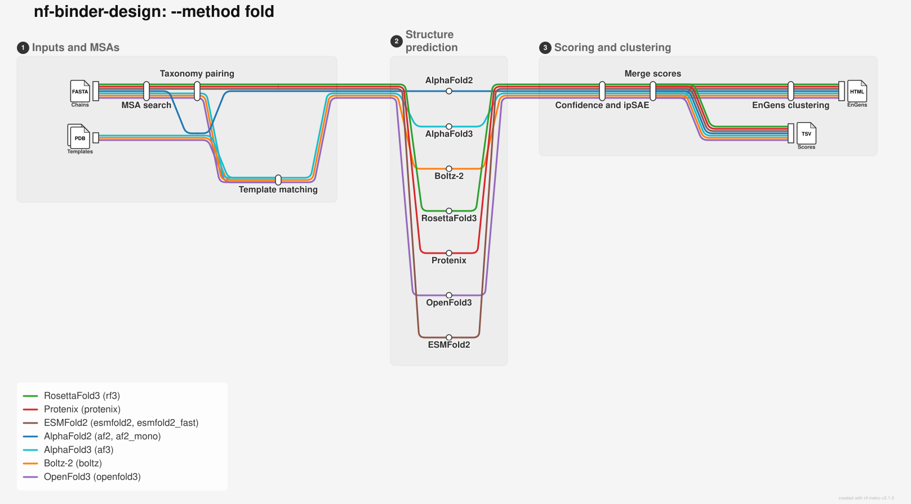

# Fold Workflow



Multi-method structure prediction for monomer **and multimer** FASTA
inputs. Predicts structures with any combination of AlphaFold2, Boltz-2,
RosettaFold3, Protenix, AlphaFold3, OpenFold3 and ESMFold2, sharing one
MSA-generation stage, then (by default) clusters the ensemble with EnGens.

> **AlphaFold3** (`--methods af3`) needs model weights that you download yourself
> under Google DeepMind's terms of use — see [AlphaFold3 weights](#alphafold3-weights).

> **Multimer:** a FASTA with more than one record folds as a protein complex
> (one record = one chain → chain IDs A, B, C, …; homo-oligomers = repeated
> records; up to 26 chains). Each engine gets a taxonomically-paired MSA in its
> native format — see [Multimer complexes](#multimer-complexes) below.

## Overview

Launched via `main.nf` with `--method fold`:

```bash
nextflow run Australian-Protein-Design-Initiative/nf-binder-design \
  --method fold \
  --input 'input/*.fasta' \
  --outdir results \
  --methods af2,boltz,rf3,protenix \
  --msa_method jackhmmer_af2 \
  -profile local
```

From a git clone:

```bash
nextflow run /path/to/nf-binder-design \
  --method fold \
  --input UL119_domain.fasta \
  --outdir results \
  --methods af2,boltz,rf3,protenix \
  --msa_method jackhmmer_af2 \
  -profile slurm,m3
```

Each input FASTA is one prediction unit: a single record folds as a monomer, and
multiple records fold together as one complex (chains A, B, C, …). Shared MSAs
feed all selected predictors; optional MSA subsample and EnGens clustering
produce a conformational ensemble from the combined predictions.

`--n_predictions` sets how many structures each method produces per input,
unset by default. See [Key Parameters](#key-parameters) below for how it maps
onto each engine's own sampling knobs and batch size.

## Command-line Options

```bash
nextflow run Australian-Protein-Design-Initiative/nf-binder-design --method fold --help
```

### Key Parameters

| Flag | Description |
|------|-------------|
| `--input` | Single FASTA, glob, or directory of FASTA files (required) |
| `--outdir` | Output directory (default: `results`) |
| `--methods` | Comma-separated: `af2`, `af2_mono`, `boltz`, `rf3`, `protenix`, `af3`, `openfold3`, `esmfold2`, `esmfold2_fast` (default: `af2`) |
| `--msa_method` | `jackhmmer_af2` (default) or `mmseqs2_colabfold` |
| `--n_predictions` | Total structures per input, per method (see below) |
| `--msa_subsample` | Off by default; `true` (default depth list) or a custom `max_seq:max_extra_seq` list. Depths with `max_seq >=` MSA size are skipped |
| `--msa_subsample_include_full` | Keep one full-MSA job when subsampling (default: `true`) |
| `--skip_engens` | Skip post-prediction EnGens clustering |
| `--engens_clustering` | `hdbscan` (default), `gmm`, `km`, or comma-separated |
| `--engens_featurizers` | `default,3di` (default); also `pb`; comma-separated |
| `--engens_superpose_method` | Superposition scheme for the geometric featurizers (default: `blosum62`) |

Method-specific flags (`--af2_*`, `--boltz_*`, `--rf3_*`, `--protenix_*`, `--af3_*`, `--openfold3_*`, `--esmfold2_*`) are
documented in `--help`.

**`--n_predictions`** is **unset by default**, in which case each engine falls
back to its own default: Boltz, RF3, Protenix, AF3, OpenFold3 and ESMFold2 each
emit **5** diffusion samples in a single job (Boltz is lifted from its native default of 1
for cross-engine parity), while AF2 does a single run and keeps per
`--af2_keep_models` (default `best` → one structure). Set `--n_predictions N` to
pin every diffusion engine to exactly N, split across jobs by that engine's own
`--*_batch_size` (e.g. `--n_predictions 10 --boltz_batch_size 5` runs Boltz as
two jobs of 5 samples each; leaving `--*_batch_size` unset runs one job of N).
AF2 has no in-run sampling knob — it always emits its 5 trained models per run,
and `--af2_keep_models` decides how many runs that takes to reach N (`best`
keeps the top-ranked model/run → N runs; `all` keeps all 5/run → `ceil(N/5)`
runs).

**Seeds** are unset by default so each engine draws its own random seed (pin
`--af2_random_seed` / `--boltz_seed` / `--rf3_seed` / `--protenix_seeds` for
reproducibility; do not inject a fresh random seed on every CLI invocation if
you want `-resume` to cache). AlphaFold3, OpenFold3 and ESMFold2 always need a
seed in their input, so they default to a fixed base seed (`--af3_seeds 1`,
`--openfold3_seeds 42`, `--esmfold2_seeds 42`); batch *i* uses `seed + i`.
`--protenix_seeds` takes the same single-base-seed convention.

## Choosing engines

| Engine | Weights | Multimer pairing | GPU per job | Relative cost |
|--------|---------|-------------------|-------------|----------------|
| **AF2** (`af2`) | Bundled in the container | Native multimer pipeline (needs the 2021 DB snapshot — see [below](#af2-multimer-needs-the-2021-db-snapshot)) | 1 | Low–medium; 5 models/run regardless of `--n_predictions` |
| **AF2 monomer** (`af2_mono`) | Bundled in the container | None (chain-break trick, not a real multimer mode) | 1 | Same as AF2; not an independent engine — see [below](#af2_mono-af2-monomer-weights-on-a-complex-chain-break) |
| **Boltz-2** (`boltz`) | Bundled in the container | Taxid-keyed CSV pairing (or its own MSA server with `--use_msa_server`) | 1 | Low |
| **RosettaFold3** (`rf3`) | Bundled in the container | `TaxID=` a3m pairing | 1 | Medium |
| **Protenix** (`protenix`) | Bundled in the container | Species-mnemonic paired/unpaired a3m | 1 | Medium |
| **AlphaFold3** (`af3`) | You download separately — see [AlphaFold3 weights](#alphafold3-weights) | Species-mnemonic pairing rendered from the shared MSA | 1 | Medium–high |
| **OpenFold3** (`openfold3`) | Bundled in the container | Online species pairing from `uniprot_hits` | 1 | Medium; JIT-compiles Triton kernels on first use |
| **ESMFold2** (`esmfold2`) | Bundled in the container | `key=<taxid>` a3m pairing, done by ESMFold2 itself | 1 | Medium |
| **ESMFold2-Fast** (`esmfold2_fast`) | Bundled in the container | None — single-sequence only, no MSA (see [below](#esmfold2)) | 1 | Low |

Every predict job takes one GPU; concurrency across jobs is governed by
`--gpu_devices` (comma-separated device list, or `all`), `--gpu_slots_per_device`
(concurrent tasks per GPU, default 1) and `--gpu_lock_timeout` (seconds a task
waits for a free slot before failing, default 14400). `af2_mono` is not an
independent vote alongside the others — see the caveats in its own section
below before including it in a consensus.

## Multiple Sequence Alignments (MSAs)

All selected predictors share one MSA stage controlled by `--msa_method`.

### Option 1: AlphaFold jackhmmer / HHblits (`jackhmmer_af2`)

Default route. Runs AlphaFold's MSA pipeline against local genetic databases
under `--af2_db_path`, then converts the resulting MSAs to an a3m for
Boltz / RF3 / Protenix. AF2 predict reuses the same features (including
templates) unless MSA subsample rebuilds features from a shallow a3m.

```bash
--msa_method jackhmmer_af2 \
--af2_db_path /path/to/alphafold_dbs \
--af2_db_preset full_dbs
```

Databases used under `--af2_db_path` (paths are fixed relative to that root):

| Database | Role |
|----------|------|
| UniRef90 | jackhmmer |
| MGnify | jackhmmer |
| BFD + UniRef30 | HHblits (`full_dbs`) |
| PDB70 + PDB mmCIF | templates |

The individual paths default to the layout produced by DeepMind's own download
script relative to `--af2_db_path` (e.g. `mgnify/mgy_clusters_2022_05.fa`,
`uniref30/UniRef30_2021_03`); override one with its own
`--af2_uniref30_subpath` / `--af2_mgnify_subpath` / `--af2_uniprot_subpath` /
`--af2_pdb_seqres_subpath` / `--af2_pdb70_subpath` flag when a snapshot uses a
different filename (needed for [AF2 multimer against the 2021
snapshot](#af2-multimer-needs-the-2021-db-snapshot), whose HHblits DB is
`uniclust30` rather than `uniref30`). See
[Setting up databases](fold-databases.md).

### Option 2: ColabFold MMseqs2 (`mmseqs2_colabfold`)

#### Remote server

```bash
--msa_method mmseqs2_colabfold --use_remote_server true
```

Queries the public ColabFold MMseqs2 API (no local DBs). Suitable for small /
occasional runs; for heavy use prefer local databases.

#### Local databases

```bash
--msa_method mmseqs2_colabfold \
--uniref30 /path/to/colabfold_dbs/uniref30 \
--colabfold_envdb /path/to/colabfold_dbs/colabfold_envdb
```

`--uniref30` must contain `uniref30_*` MMseqs2 DB files;
`--colabfold_envdb` must contain `colabfold_envdb*` files (layout produced by
[`scripts/download_colabfold_dbs.sh`](fold-databases.md#colabfold-mmseqs2-databases)).

> There is no site-wide default ColabFold DB path on M3 yet — use
> `--use_remote_server true` or install local DBs yourself.

### MSA subsample (optional)

CF-random-style shallow random MSAs per predict task:

```bash
--msa_subsample true
# or a custom list, e.g. --msa_subsample '1:2,8:16,64:128'
```

`--msa_subsample true` uses depths `1:2,2:4,...,64:128`.
`--msa_subsample_include_full` (default `true`) also keeps one full-MSA job
(AF2 retains jackhmmer templates on that path). Depths with `max_seq` greater
than or equal to the MSA sequence count are skipped (they would only shuffle
the full MSA). For each depth job (including full), `fold/msa_ids/` lists
`header_line<TAB>id` where `header_line` is the 0-based file line of that
sequence's `>` header in the original a3m (disambiguates duplicate accessions).

## Multimer complexes

A FASTA with more than one record folds as a **protein complex**: each record is
one chain, in file order, assigned chain IDs `A, B, C, …` (up to 26). A
homo-oligomer is expressed as **repeated identical records** (a `count:`
shorthand is not implemented yet). No ligands / nucleic acids this round —
protein complexes only.

```bash
nextflow run /path/to/nf-binder-design --method fold \
  --input input/complex.fasta \
  --methods af2,boltz,rf3,protenix \
  --msa_method jackhmmer_af2 \
  -profile slurm,m3
```

### Paired MSAs (how each engine differs)

For a complex, co-evolutionary **pairing** across chains is what carries the
interface signal. Each engine consumes a paired MSA in a *different* native
format, so the fold workflow searches each chain independently and then renders
each engine's format from one canonical taxonomy parse. When `af2` or `af2_mono`
is also selected under `jackhmmer_af2`, the per-chain MSAs come from AF2's own
multimer search of the complex rather than a second search of each chain:

| Engine | How it pairs | What the fold workflow feeds it |
|--------|--------------|--------------------------|
| **AF2** | Its own native multimer pipeline (jackhmmer + species pairing) | The whole complex + `--model_preset=multimer` against the 2021 DB snapshot |
| **RF3** | atomworks pairs by numeric `TaxID=<n>` in a3m headers | Per-chain a3m with `TaxID=` annotated headers |
| **Protenix** | Pairs by species *mnemonic* (`_HUMAN`, `_9BETA`) | Per-chain `pairedMsaPath` (mnemonic headers) + `unpairedMsaPath` |
| **AF3** | Pairs by species mnemonic, parsed only from UniProt-style `tr\|ACC\|NAME_SPECIES` headers | Per-chain `pairedMsaPath` re-rendered with `tr\|…_SPECIES` headers + `unpairedMsaPath` (AF3's own data pipeline is never run) |
| **OpenFold3** | Pairs online by species, read from the 4th field of `uniprot_hits` headers | Per-chain directory with `colabfold_main.a3m` (unpaired) + `uniprot_hits.a3m` re-rendered as `tr\|ACC\|ACC_SPECIES/1-N` (pairing only) |
| **Boltz-2** | Pairs rows across chains sharing a taxid `key` | Per-chain `key,sequence` CSV (`key = taxid`) |
| **ESMFold2** | Pairs rows across chains sharing a `key=<taxid>` token, done by ESMFold2 itself | One a3m per chain with `key=<taxid>` headers; unlike the other renders, rows with no taxonomy are kept (laid out block-diagonally) |

RF3 / Protenix / Boltz's rendered per-chain files are published under
`<outdir>/fold/msa/paired/`, and each render logs its paired-row depth per
chain. AF3, OpenFold3 and ESMFold2 render their own pairing input inline
inside their respective predict/input-prep tasks, so their re-rendered a3ms
are not published under `msa/paired/`.

> **Use `--msa_method jackhmmer_af2` for paired multimers.** Only the jackhmmer
> route produces the rich UniProt/UniRef headers (`TaxID=`, `RepID=`,
> `sp|/tr|…_SPECIES`) that taxonomy pairing needs. The ColabFold route emits
> taxonomy-less headers, so under `mmseqs2_colabfold` the chains fold **unpaired**
> — for a ColabFold-style multimer use `--use_msa_server true` instead (Boltz
> fetches and pairs its own MSA; drop `af2` from `--methods`).

### AF2 multimer needs the 2021 DB snapshot

AF2 multimer loads different weights (`--model_preset=multimer`) and a different
data pipeline that pairs species **internally** against the `uniprot/` all-seqs
DB + `pdb_seqres/` templates. The default `alphafold_20240229` snapshot is
monomer-only (no `uniprot/`), so the fold workflow fails fast if `af2` (or
`af2_mono` under `jackhmmer_af2`) is requested for a multimer without a
`uniprot/`-bearing `--af2_db_path`. Point it at the 2021 snapshot
(`/mnt/datasets/alphafold/alphafold_20211129` on M3), whose HHblits DB is
`uniclust30` rather than `uniref30` — override `--af2_uniref30_subpath` (and
`--af2_mgnify_subpath`, `--af2_uniprot_subpath`, `--af2_pdb_seqres_subpath`)
accordingly. The `alphafold2` container bundles **multimer_v3** model weights
(`params_model_*_multimer_v3.npz`) alongside the monomer/ptm weights, so
`--af2_data_dir` does not need to be overridden for multimer mode — it only
needs pointing at a host `params/` directory if you are running without the
bundled weights. See [`examples/fold-multimer/`](https://github.com/Australian-Protein-Design-Initiative/nf-binder-design/tree/main/examples/fold-multimer)
(`nextflow.m3.config` + `run-m3.sh`) for a working set of overrides.
`--num_multimer_predictions_per_model` (`--af2_num_predictions_per_model`)
applies in multimer mode.

### `af2_mono`: AF2 monomer weights on a complex (chain break)

`--methods af2_mono` folds a complex with the **monomer** weights
(`--af2_monomer_model_preset`, default `monomer_ptm`): the chains are concatenated
into one sequence and separated only by a jump of `--af2_chain_break_offset`
(default 200) in `residue_index`. AF2 clips relative positions at 32, so anything
above that reads as "not covalently connected". The MSA is block diagonal — each
chain's own hits, gapped outside that chain's columns. Output is split back into
real chains automatically, renumbered `1..L` per chain, so it feeds ipSAE and
everything else exactly like the other engines.

It reuses the same per-chain MSAs as `af2`; only `features.pkl` differs. You can
run both in one pipeline — their predictions, score TSVs (`tool` column `af2` vs
`af2_mono`) and `fold/predictions/` filenames are kept separate. It works with
either MSA route (`jackhmmer_af2` or `mmseqs2_colabfold`), with `--msa_subsample`,
and with homo-oligomer inputs; under `jackhmmer_af2` a multimer still needs a
`uniprot/`-bearing `--af2_db_path` (same requirement as `af2` itself), because
`af2_mono`'s per-chain MSAs come from AF2's multimer search even though the
predict step then uses the monomer weights.

**When this is worth reaching for.** AF2-multimer pairs MSA rows across chains
by taxonomy. If one chain has no homologs — a de novo designed binder, say —
there is nothing to pair, so the merged MSA is block diagonal anyway.
`af2_mono` carries the same information without the multimer head, as a
controlled contrast.

**Two things to know before using it.**

1. **Pair it with `--af2_keep_models best`.** Without an initial guess the monomer
   models have no reason to dock the chains, and frequently don't — ranking
   (mean pLDDT for monomer presets) reliably separates a docked pose from a
   failed one, but `all` would inject the failed poses into any downstream
   consensus. The workflow warns if you select `af2_mono` without `best`.
2. **It is not an independent engine.** `monomer_ptm` and `multimer` share an
   architecture family and a training corpus. Treat it as a second opinion from the
   same lineage, never as another vote alongside Boltz / RF3 / Protenix.

Monomer presets do template search with hhsearch over `pdb70` rather than hmmsearch
over `pdb_seqres`, so `--af2_pdb70_subpath` must resolve under `--af2_db_path`
(this is the one existence check the multimer path never reaches; it is honoured
by the MSA stage as well as predict).

`--msa_subsample` is monomer-only and is rejected for multimer inputs.

## AlphaFold3 weights

The AlphaFold3 container (`ghcr.io/australian-protein-design-initiative/containers/alphafold3:3.0.4`)
does **not** include the model parameters. They are released by Google DeepMind
under the [AlphaFold3 Model Parameters Terms of Use](https://github.com/google-deepmind/alphafold3/blob/main/WEIGHTS_TERMS_OF_USE.md)
and [Prohibited Use Policy](https://github.com/google-deepmind/alphafold3/blob/main/WEIGHTS_PROHIBITED_USE_POLICY.md).
In short, they are for **non-commercial use only**, may **not be shared outside your
organisation**, and AF3 outputs may not be used to train other structure predictors.
Read the terms in full before downloading.

The pipeline looks for the weights in `--af3_model_dir`, which defaults to
`models/alphafold3/` in your copy of the pipeline. That default resolves
relative to the pipeline checkout, so if you launch the pipeline by revision
(`nextflow run Australian-Protein-Design-Initiative/nf-binder-design ...`)
rather than from a local clone, pass `--af3_model_dir` explicitly — the
default would otherwise point inside Nextflow's own cached copy of the
pipeline under `~/.nextflow/assets/`. To download the weights there:

```bash
# From a clone of nf-binder-design; prints the terms and asks you to type 'yes'
./models/download_af3_weights.sh

# Or somewhere else (eg a group-shared location within your organisation)
./models/download_af3_weights.sh -o /path/to/af3_weights
# ... then run the pipeline with --af3_model_dir /path/to/af3_weights
```

Or download `af3.bin.zst` manually and put it in a directory of its own. Notes:

- The directory must contain **exactly one** model file (`af3.bin.zst` or
  `af3.bin`). AlphaFold3 reads the compressed `.zst` directly, so you don't need
  to decompress it.
- The pipeline checks the directory before starting and fails early with
  instructions if the weights are missing.
- You don't need any bind-mount configuration. The directory is staged into each
  AlphaFold3 task as `af3_models/`, which Docker, Apptainer and Singularity mount
  automatically, and passed to AF3 as `--model_dir=af3_models`.
- AF3's genetic databases are **not** needed. The pipeline supplies MSAs from its
  shared MSA stage and runs AF3 with `--run_data_pipeline=false`.
- Pre-Ampere GPUs (V100, T4; compute capability 7.x) need a workaround, which
  `--af3_flash_attention auto` (the default) applies: xla flash attention plus
  `XLA_FLAGS=--xla_disable_hlo_passes=custom-kernel-fusion-rewriter`. Ampere or
  newer (A100, H100, L40S) uses triton.
- `--af3_batch_size` sets diffusion samples per job (`--num_diffusion_samples`,
  default 5); `--n_predictions` splits across jobs as for the other diffusion
  engines. `--af3_seeds` sets the base seed (default 1); batch *i* uses
  `seed + i`. `--af3_num_recycles` defaults to 10.
- `--af3_jax_cache_dir /some/shared/dir` keeps JAX compilation results between
  tasks, which saves several minutes per job for repeated input sizes.

## OpenFold3

OpenFold3 (`--methods openfold3`) runs from
`ghcr.io/australian-protein-design-initiative/containers/openfold3:0.5.0_nv-cuda12_weights`,
which includes the default OpenFold3 checkpoint under `/models/openfold3`, so no
download or weights flag is needed.

- MSAs come from the shared MSA stage (`--use-msa-server false`). Templates are
  used only with `--templates` (see [Templates](#templates)). Each chain's MSA directory holds the shared a3m as
  `colabfold_main.a3m`, and multimers add a species-tagged `uniprot_hits.a3m`
  for cross-chain pairing.
- `--openfold3_batch_size` sets diffusion samples per job
  (`--num-diffusion-samples`); `--n_predictions` splits across jobs as for the
  other diffusion engines.
- OpenFold3 JIT-compiles Triton kernels on first use. By default the cache lives
  in each task's work directory; `--openfold3_kernel_cache_dir /some/shared/dir`
  keeps it between tasks.

## ESMFold2

ESMFold2 comes as two engines, run through the `esm` package (v3.4.1.post1).
Select either or both, e.g. `--methods esmfold2,esmfold2_fast` to compare them:

| Method | Checkpoint | Container | MSA |
|--------|------------|-----------|-----|
| `esmfold2` | `biohub/ESMFold2` | `esmfold2:3.4.1.post1_nv-cuda13_full_weights` | Yes (multimers paired by ESMFold2 itself) |
| `esmfold2_fast` | `biohub/ESMFold2-Fast` | `esmfold2:3.4.1.post1_nv-cuda13_fast_weights` | Never — always folds from sequence alone |

- Weights (including the ESMC-6B language-model encoder) are baked into each
  container, so nothing is downloaded at run time. `--esmfold2_weights_dir`
  (exported as `HF_HOME`) points both engines at an external HuggingFace cache
  instead.
- `esmfold2_fast` has no MSA encoder, so it never uses or triggers an MSA
  search: on its own it skips the MSA stage entirely, and alongside other
  engines it ignores the MSAs they share. The pipeline logs a warning to that
  effect whenever it is selected.
- `--esmfold2_single_sequence` also folds `esmfold2` (the full checkpoint)
  from the sequence alone, skipping its MSA — a useful comparison against
  `esmfold2_fast`.
- The `esm` package ships no command-line tool, so the pipeline drives its
  Python API through `bin/fold/run_esmfold2.py`.
- `--esmfold2_kernel_backend` (`fused` default, `cuequivariance`, or `none`):
  `fused` is roughly 3.5x faster and falls back silently to the reference path
  if Triton is unavailable.
- The options below are shared by both engines (`--esmfold2_msa_max_depth`
  only affects `esmfold2`). `--esmfold2_batch_size` sets diffusion samples per job; `--n_predictions`
  splits across jobs as for the other diffusion engines. `--esmfold2_seeds`
  sets the base seed (default 42); batch *i* uses `seed + i`.
  `--esmfold2_num_loops`, `--esmfold2_num_sampling_steps` and
  `--esmfold2_msa_max_depth` default to the `esm` package's own values (20,
  200, 1024 respectively).
- ESMFold2 reports **no ranking score** — its `ranking_score` column is blank
  in the fold score table, so rank on `iptm` / `plddt` / `ipsae` instead. It
  does report ptm, iptm, per-token pLDDT and a PAE matrix, plus a per-chain-pair
  ipTM matrix, so ipSAE is computed as usual.

## Templates

`--templates` takes known structures (`.pdb` or `.cif`, optionally gzipped) as
a directory or glob. The files can hold single chains or whole complexes. No
mapping file is needed. Every protein chain in every file is aligned to every
chain being folded, much as AF2's template search does with the PDB, and kept
for that chain when it passes both thresholds:

| Option | Default | Meaning |
|--------|---------|---------|
| `--template_min_identity` | `0.3` | Identity over the aligned residues |
| `--template_min_coverage` | `0.3` | Fraction of the folded chain covered by the alignment |
| `--template_max_per_chain` | `4` | Best matches (identity × coverage) kept per chain |

The match report and the normalised template files are published under
`<outdir>/fold/templates/` (`templates_matched.tsv` lists every chain pair
considered and why it was accepted or rejected). Templates only inform each
chain's own structure; no engine takes the arrangement between chains from them.

Templates are used by `af3`, `boltz` and `openfold3`. Other engines fold without
them, with a warning. Notes for each engine:

- **AF3:** the matched templates are added to each chain's input with an explicit
  residue mapping (`queryIndices` / `templateIndices`).
- **Boltz-2:** each template is pinned to its chain (`chain_id`). Boltz aligns the
  template itself and uses only its longest gap-free match, so a template with
  missing loops contributes just one segment.
  `--boltz_template_force` holds the chain within `--boltz_template_threshold`
  (default 1.0 Å) of the template. It is off by default in `--method fold`, where
  the template should guide the prediction without over-biasing it, and on by
  default in `--method fold_pulldown`.
- **OpenFold3:** templates are passed as CIF files (its CIF-direct mode), and
  OpenFold3 realigns them to the chain with kalign. The pipeline points its
  template structure directory at the staged files and turns off downloads from
  RCSB.

> Weak, short matches can pass the default thresholds. For example, a de novo
> design can align to a 26–33 residue stretch of an unrelated structure at about
> 35% identity. Check `templates_matched.tsv`, and raise the thresholds when
> you only want close templates.

## Example Usage

Minimal AF2-only run with jackhmmer MSAs:

```bash
nextflow run /path/to/nf-binder-design --method fold \
  --input input/pdl1.fasta \
  --outdir results \
  --methods af2 \
  --msa_method jackhmmer_af2 \
  --af2_db_path /mnt/datasets/alphafold/alphafold_20240229 \
  -profile local
```

Multi-method ensemble (25 structures per method) with ColabFold remote MSA:

```bash
nextflow run /path/to/nf-binder-design --method fold \
  --input UL119_domain.fasta \
  --outdir results \
  --methods af2,boltz,rf3,protenix,openfold3,esmfold2,esmfold2_fast \
  --msa_method mmseqs2_colabfold \
  --use_remote_server true \
  --n_predictions 25 \
  --af2_keep_models all \
  -profile slurm,m3
```

See `examples/fold/run-m3.sh` and `examples/fold/run-local.sh` for complete
HPC / workstation wrappers (including Apptainer bind mounts for AF2 DBs).

## EnGens clustering

After prediction, EnGens runs by default (UMAP + HDBSCAN) and writes
`results/engens/<id>/clusters.html` plus representative conformations.
With the default `--engens_featurizers default,3di`, the report also encodes
each structure as a [3Di](https://www.biotite-python.org/latest/apidoc/biotite.structure.alphabet.I3DSequence.html)
local-structure string (Foldseek alphabet via biotite), shows pairwise 3Di
identity and per-residue entropy, and runs UMAP/clustering on a 3Di
substitution-matrix embedding alongside EnGens' geometric featurizers.
Sequences and entropy tables are published under
`results/engens/<id>/structural_alphabet/`.

| Flag | Description |
|------|-------------|
| `--skip_engens` | Skip clustering |
| `--engens_clustering` | `hdbscan` (default), `gmm`, `km`, or comma-separated |
| `--engens_featurizers` | `default` (EnGens residue_mindist / torsions), `3di`, `pb` (comma-separated; default: `default,3di`) |
| `--engens_min_structures` | Minimum structures before clustering (default: 3) |
| `--engens_max_clusters` | Upper bound for auto cluster-count search |

To cluster an existing folder of `.cif` / `.pdb` without re-folding, use the
standalone `engens.nf` workflow:

```bash
nextflow run /path/to/nf-binder-design/engens.nf \
  --input results/fold/predictions/ \
  --id UL119_domain \
  --outdir results \
  -profile slurm,m3
```

## Output

Default layout under `--outdir` (`params.json` and `logs/` sit at the outdir
root, alongside `fold/`, not inside it — they are shared across every
`--method`):

```
results/
├── params.json
├── logs/                     # report/trace/timeline/dag + gpu_trace_<datestamp>.txt
├── fold/
│   ├── msa/<msa_method>/     # shared MSAs + a3m (jackhmmer_af2 or mmseqs2_colabfold)
│   ├── af2/msas/             # AF2-only features.pkl (not under fold/msa/)
│   ├── af2/ … boltz/ … rf3/ … protenix/ … af3/ … openfold3/ … esmfold2/ … esmfold2_fast/    # per-engine predictions + <tool>_fold_scores.tsv
│   ├── predictions/          # flat gather: af2_*, boltz_*, rf3_*, protenix_*, af3_*, openfold3_*, esmfold2_*, esmfold2_fast_* mmCIF
│   ├── fold_scores.tsv       # master score table: one row per generated structure
│   ├── msa_ids/              # when --msa_subsample: header_line<TAB>id (0-based '>' line)
│   └── templates/            # when --templates: templates_matched.tsv + normalised tmpl*.cif
└── engens/<id>/              # clusters.html + representative conformations (HDBSCAN by default)
                              # + structural_alphabet/ (3Di FASTA + entropy when enabled)
```

### Score table (`fold/fold_scores.tsv`)

One row per generated structure across all engines. Each engine also writes a
per-tool table (`fold/<tool>/<tool>_fold_scores.tsv`); the master merges them,
**normalizing column names** for equivalent scores. Provenance columns name the
`tool`, input `id`, `model`/sample index, `batch` (which predict job produced
it) and `msa_depth` (MSA subsample depth, blank unless `--msa_subsample` was
used), the engine-native `original_file`, and the renamed `predictions_file` in
`fold/predictions/` (unique per structure).

| Column | Meaning | AF2 | Boltz | Protenix | RF3 | AF3 | OpenFold3 | ESMFold2 / ESMFold2-Fast |
|--------|---------|-----|-------|----------|-----|-----|-----------|----------|
| `ranking_score` | engine's overall ranking metric | `ranking_confidence` (0.8×ipTM + 0.2×pTM for multimer presets; mean pLDDT for monomer presets, incl. `af2_mono`) | confidence_score | ranking_score | ranking_score | ranking_score | sample_ranking_score | – (not reported; rank on `iptm`/`plddt`/`ipsae`) |
| `ptm` / `iptm` | (interface) predicted TM-score | ✓ (pkl) | ✓ | ✓ | ✓ | ✓ | ✓ | ✓ |
| `plddt` | mean pLDDT, **rescaled to 0–1** | ✓ | ✓ | ✓ | ✓ | ✓ (mean per-atom) | ✓ | ✓ (per-token) |
| `pae` / `pde` | overall predicted aligned / distance error | – | pde | pde (`gpde`) | pae, pde | pae (mean) | pae (mean), pde (`gpde`) | pae (mean) |
| `has_clash` | steric-clash flag | – | – | ✓ | ✓ | ✓ | ✓ | – |
| `ipsae`, `ipsae_d0chn`, `ipsae_d0dom`, `pdockq`, `pdockq2`, `lis` | ipSAE interface metrics (`bin/ipsae.py`) | ✓ (computed) | ipsae only | ✓ (computed) | ✓ (computed) | ✓ (computed) | ✓ (computed) | ✓ (computed) |

Blank where an engine doesn't report a metric. Asymmetric per-chain-pair scores
(e.g. Protenix `chain_pair_iptm`, Boltz `pair_chains_iptm`) are intentionally
omitted — only the overall values are reported.

## Setting up databases

Local databases are only needed for `--msa_method jackhmmer_af2`, or for
`--msa_method mmseqs2_colabfold` without `--use_remote_server true`. See
[Setting up databases](fold-databases.md) for download scripts, expected
layout, and the site defaults on M3.

## Related

- Example run directory: [`examples/fold/`](https://github.com/Australian-Protein-Design-Initiative/nf-binder-design/tree/main/examples/fold)
- [Setting up databases](fold-databases.md)
- Boltz Pulldown also accepts `--uniref30` / `--colabfold_envdb` for local MSAs
  ([Boltz Pulldown](boltz-pulldown.md))
- Standalone EnGens: `engens.nf`
